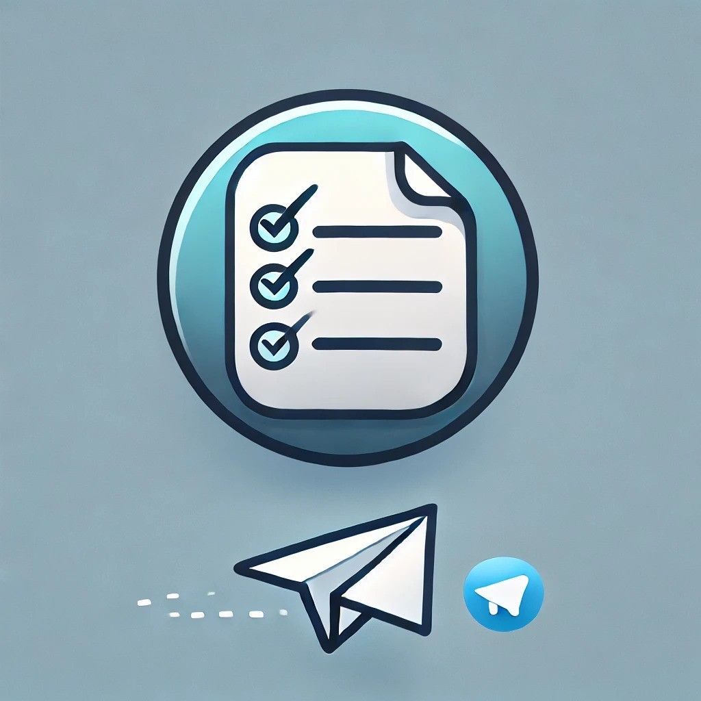
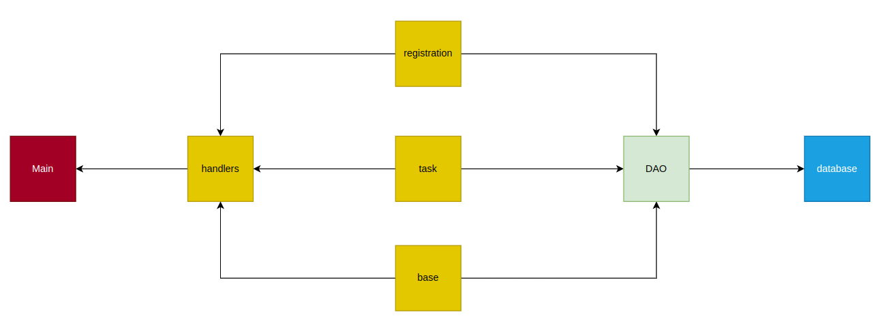
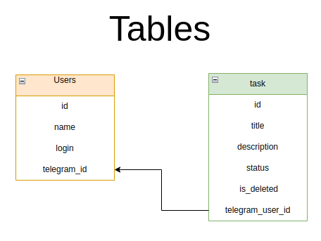

# Your Every Day Tasks

### Developer: Roman Sysa (Сыса Роман)



---

### 📃 Содержание

1. ✏️ [Описание проекта](#project_desc)
    - 📋 [Задачи](#goals)
    - 📟 [Функциональные возможности](#func_abilities)
2. 📱 [Технологии проекта](#project_technologies)
3. 📐 [Архитектура](#architecture)
4. 🔌 [Установка и запуск](#installation_and_launch)
5. 🧙 [Авторы](#authors)
   <a name="project_desc"></a>

## ✏️ Описание проекта ##

Проект реализует Telegram-бот для управления задачами (Todo) с
использованием <a href="https://docs.aiogram.dev/en/latest/">Aiogram 3</a>. Бот позволяет пользователям
регистрироваться, добавлять задачи, обновлять их статус и управлять списком задач. Проверить работу бота
можно <a href="https://t.me/maxbitsolution_todo_bot">здесь</a>.

<a name="goals"></a>

### 📋 Задачи ###

<ul>
   <li>✅ Регистрация пользователей</li>
   <li>✅ Создание, просмотр и управление задачами</li>
   <li>✅ Обновление статуса задач (выполнено/не выполнено)</li>
   <li>✅ Удаление задач</li>
</ul>

<a name="func_abilities"></a>

### 📟 Функциональные возможности ###

- Регистрация пользователя в системе.
- Добавление новой задачи.
- Обновление статуса задачи.
- Удаление задачи.
- Просмотр всех задач пользователя.

<a name="project_technologies"></a>

## 📱 Технологии проекта ##

- Язык программирования - `Python 3.11`
- База данных - `SQLite`
- Фреймворк - `Aiogram 3`
- Контейнеризация - `Docker`

<a name="architecture"></a>

## 📐 Архитектура ##

Проект состоит из следующих основных компонентов:

1. **Connection** - Управление подключением к базе данных SQLite.
2. **UsersDAO** - Работа с данными пользователей.
3. **TasksDAO** - Работа с данными задач.
4. **Бизнес-логика бота** - Основная логика обработки команд и взаимодействие с базой данных через хэндлеры для каждого
   отдельного роута.

### Диаграмма компонентов



## 🪧 Таблицы

У БД есть две таблицы:
<ul>
<li> users - таблица, хранящая пользователей</li>
<li> task - таблица, хранящая задачи пользователя</li>
</ul>

### Диаграмма таблиц




<a name="installation_and_launch"></a>

## 🔌 Установка и запуск ##

# Способ № 1 - без докера

1. Скачайте репозиторий. Для этого выполните команду:
   ```commandline
   git clone git@github.com:menma331/tg-todo.git
   ```

2. Перейдите в директорию проекта и установите зависимости:

   ```commandline
   cd src
   ```

   ```commandline
   pip install -r requirements.txt
   ```

3. Создайте файл `.env` в корневой директории. Получите токен бота (подробно о том, как получить токен, можно
   узнать <a href="https://core.telegram.org/bots">здесь</a>), и добавьте его в файл `.env` по примеру:

   ```commandline
   BOT_TOKEN=123456789:ABCDEFGHIJKLMNOPQRSTUVWXYZ
   ```

4. Запустите:
   ```commandline
   python3 main.py
   ```

# Способ № 2 - Docker😇

1. Скачайте репозиторий
   ```commandline
   git clone git@github.com:menma331/tg-todo.git
   ```
2. По образцу `Dockerfile.example` создайте `Dockerfile` и введите в него свои данные
   #### Пример
   ```dockerfile
   FROM python:3.11
   
   WORKDIR /src
   ENV BOT_TOKEN="123456789:ABCDEFGHIJKLMNOPQRSTUVWXYZ"
   
   # Копируем файл зависимостей и устанавливаем их
   COPY src/requirements.txt .
   RUN pip3 install -r requirements.txt
   
   # Копируем весь проект, включая базу данных и main.py
   COPY src/ .
   
   ENTRYPOINT ["python3", "main.py"]

   ```
3. Билдим и запускаем (Linux)
   #### Билдим
   ```commandline
   sudo docker build -t todo ./
   ```
   #### Запускаем
   ```commandline
   sudo docker run todo
   ```

<a name="authors"></a>

## 🧙‍️ Авторы

- [Сыса Роман Алексеевич](https://github.com/menma331)

Если возникла проблема

<a href="https://t.me/azirafiele">Связаться 📞</a>

--- 
 